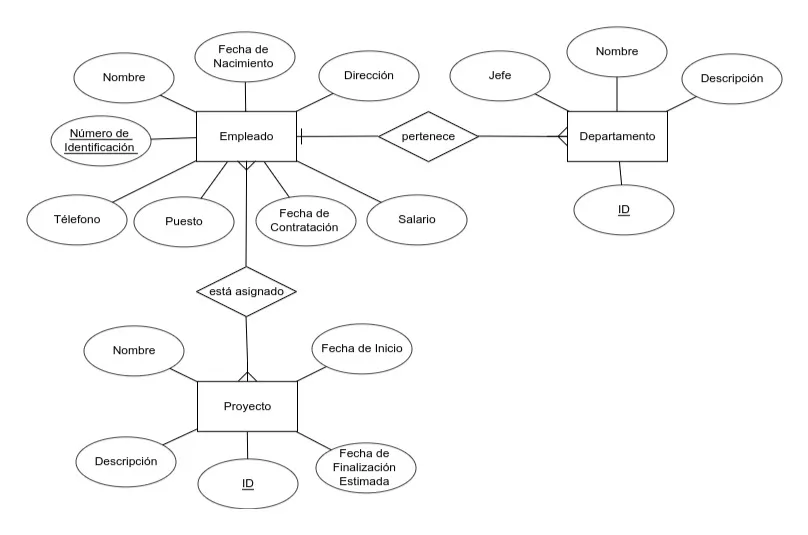
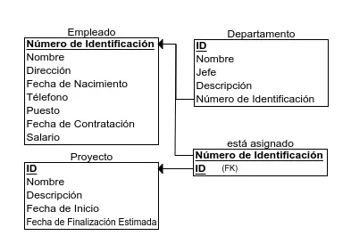
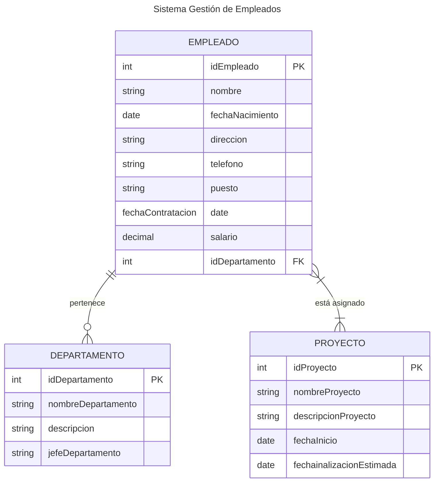

# Sistema Gestión de Empleados

## Transformación del diagrama entidad relación al modelo relacional

### Diagrama entidad-relación

### Modelo Relacional

<!-- 

```mermaid
---
title: Sistema Gestión de Empleados
---
erDiagram

    EMPLEADO {
        int idEmpleado PK
        string nombre
        date fechaNacimiento
        string direccion
        string telefono
        string puesto
        fechaContratacion date
        decimal salario
        int idDepartamento FK
    }
    DEPARTAMENTO {
        int idDepartamento PK
        string nombreDepartamento
        string descripcion
        string jefeDepartamento 
    }
    PROYECTO {
        int idProyecto PK
        string nombreProyecto
        string descripcionProyecto
        date fechaInicio
        date fechainalizacionEstimada
    }
    EMPLEADO ||--o{ DEPARTAMENTO : pertenece
    EMPLEADO }|--|{ PROYECTO : "está asignado"
```
-->