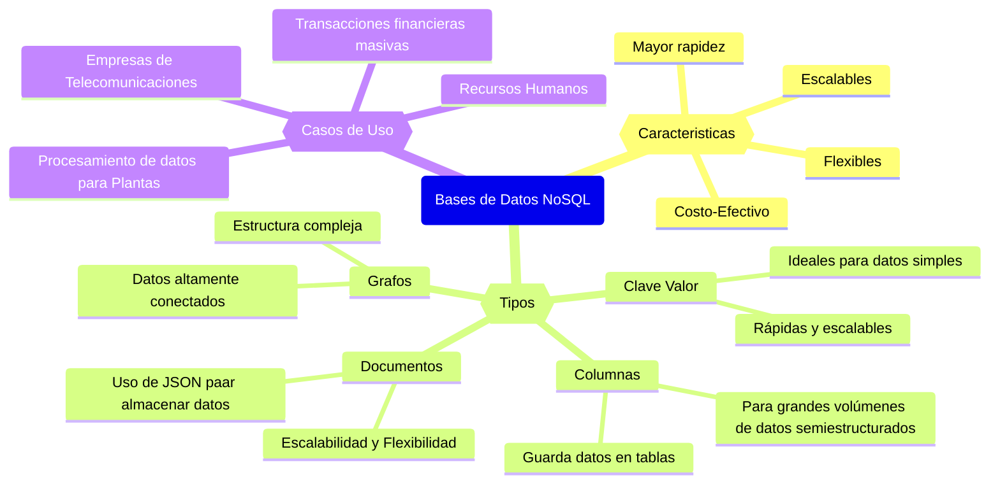

```mermaid
mindmap
	root(Bases de Datos NoSQL)
		{{Caracteristicas}}
			Escalables
			Flexibles
			Costo-Efectivo
			Mayor rapidez
		{{Tipos}}
			Clave Valor
				Rápidas y escalables
				Ideales para datos simples
			Columnas
				Para grandes volúmenes de datos semiestructurados
				Guarda datos en tablas
			Documentos
				Uso de JSON paar almacenar datos
				Escalabilidad y Flexibilidad
			Grafos
				Datos altamente conectados
				Estructura compleja
			
		{{Casos de Uso}}
			Empresas de Telecomunicaciones
			Procesamiento de datos para Plantas
			Transacciones financieras masivas
			Recursos Humanos
```