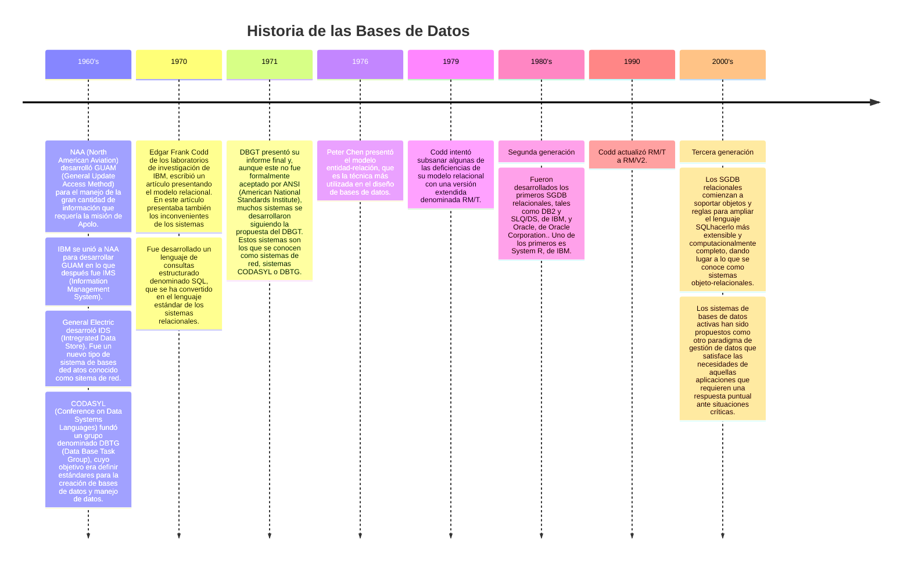

## Referencias

- Marqués, M. (1509). Bases de datos: ( ed.). Castelló de la Plana, Spain: D - Universitat Jaume I. Servei de Comunicació i Publicacions. Recuperado de https://elibro-net.wdg.biblio.udg.mx:8443/es/ereader/udg/51645