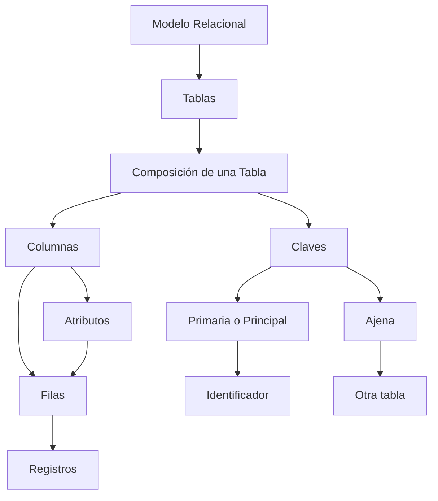

# Modelo Relacional

El **modelo relacional** consiste en un conjunto de tablas que están relacionadas entre sí. Estas tablas no son mas que una lista de valores con un nombre, donde cada valor es una fila o registro compuesto por una o más columnas o campos.

## Composición de una Tabla

### Primarias

- **Columnas**: Contienen los distintos atributos o campos en los que se desglosará la información.
- **Filas**: Almacenarán las distintas estancias denominadas "registros".

### Adicionales

- **Claves**:
	- **Primaria o Principal**: Campo que realiza la función de *identificador*. Cada *identificador* debe ser único para cada registro.
	- **Ajena**: Campos de la tabla en las que se establecen la relación con otra tabla.

## Referencias

- Jiménez Capel, M. Y. (2015). _Bases de datos relacionales y modelado de datos_ (UF1471): (ed.). Antequera, Málaga, Spain: IC Editorial. Recuperado de https://elibro-net.wdg.biblio.udg.mx:8443/es/ereader/udg/44139?page=32.