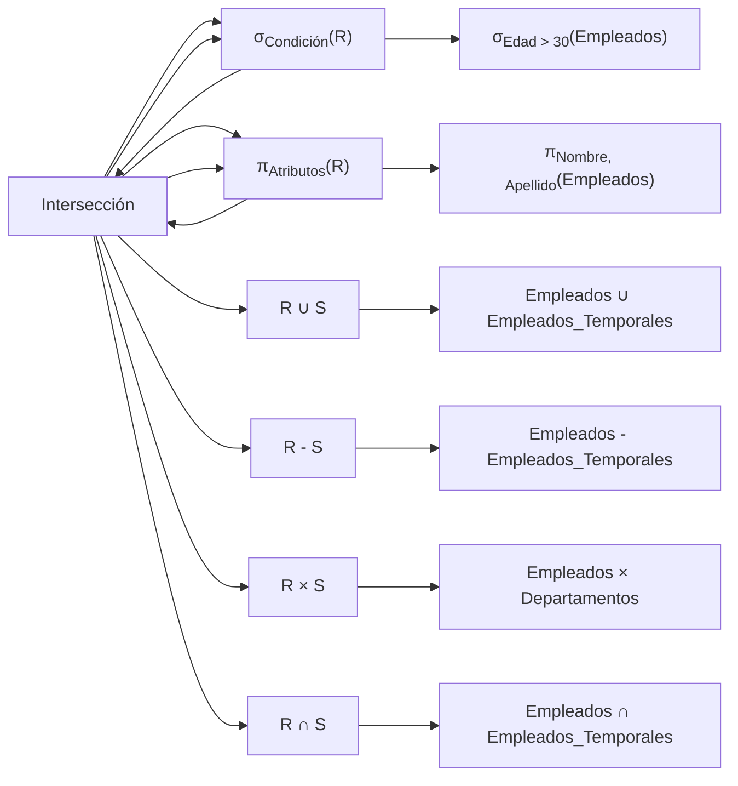

# Notación Matemática de las Operaciones Básicas del Álgebra Relacional

En el campo de la informática y la gestión de bases de datos, tanto la notación matemática como los operadores de álgebra relacional desempeñan un papel fundamental. Estas herramientas ofrecen un medio preciso y formal para describir las relaciones entre conjuntos de datos y realizar diversas operaciones sobre ellos. En este informe, nos adentraremos en los detalles de la notación matemática y los operadores de álgebra relacional, explorando su importancia y aplicaciones en el ámbito informático.

## Símbolos

Como "+" para la adición, "-" para la sustracción, "\*" para la multiplicación, "/" para la división, "=" para la igualdad, "<" y ">" para la comparación, entre otros.

## Variables y Constantes

- Letras y números que representan cantidades desconocidas (variables) o valores fijos (constantes) en expresiones matemáticas. 
- Operadores: Funciones matemáticas como seno, coseno, logaritmo, exponencial, entre otras, que realizan operaciones específicas sobre valores numéricos. 
- Conjuntos y relaciones: Representaciones abstractas de colecciones de elementos y las relaciones entre ellos, que pueden expresarse mediante notación de conjuntos y funciones. 

## Álgebra Relacional

 El álgebra relacional constituye un lenguaje formal para describir operaciones sobre relaciones y conjuntos de datos en bases de datos relacionales. Introducido por Edgar F. Codd en la década de 1970 como parte del modelo relacional para la gestión de bases de datos, se basa en un conjunto de operadores que actúan sobre relaciones y generan nuevas relaciones como resultado. Entre los operadores más comunes se encuentran la selección, la proyección, la unión, la intersección, la diferencia, el producto cartesiano y la unión por condición de igualdad entre columnas específicas. Estos operadores se utilizan en consultas SQL para recuperar, manipular y gestionar datos en sistemas de gestión de bases de datos relacionales. Algunos de los operadores más comunes en álgebra relacional son:

- Selección (σ): Permite seleccionar tuplas de una relación que satisfacen ciertos criterios de selección. 
- Proyección (π): Permite seleccionar columnas específicas de una relación y eliminar duplicados. 
- Unión (∪): Combina dos relaciones para producir una nueva relación que contiene todas las tuplas de ambas relaciones, eliminando duplicados.
- Intersección (∩): Encuentra tuplas que están presentes en ambas relaciones. 
- Diferencia (-): Encuentra tuplas que están en una relación pero no en la otra.
- Producto Cartesiano (×): Combina todas las tuplas de dos relaciones para formar una nueva relación.
- Join (⨝): Combina dos relaciones en función de una condición de igualdad entre columnas específicas. 

## Conclusión
  
En conclusión, la notación matemática y los operadores de álgebra relacional son herramientas esenciales en el ámbito de la informática y la gestión de bases de datos. La notación matemática proporciona un lenguaje preciso y formal para describir relaciones, operaciones y fórmulas matemáticas, mientras que el álgebra relacional ofrece un marco formal para realizar operaciones sobre relaciones y conjuntos de datos en bases de datos relacionales. Estas herramientas son ampliamente utilizadas en diversos campos de la informática y son fundamentales para modelar, manipular y gestionar datos de manera eficiente.

## Referencias

- Scheinerman, E. R. (2011). Mathematical Notation: A Guide for Engineers and Scientists.  SIAM Review.
- Garcia-Molina, H., Ullman, J. D., & Widom, J. (2001). Database Systems: The Complete Book. Prentice Hall.