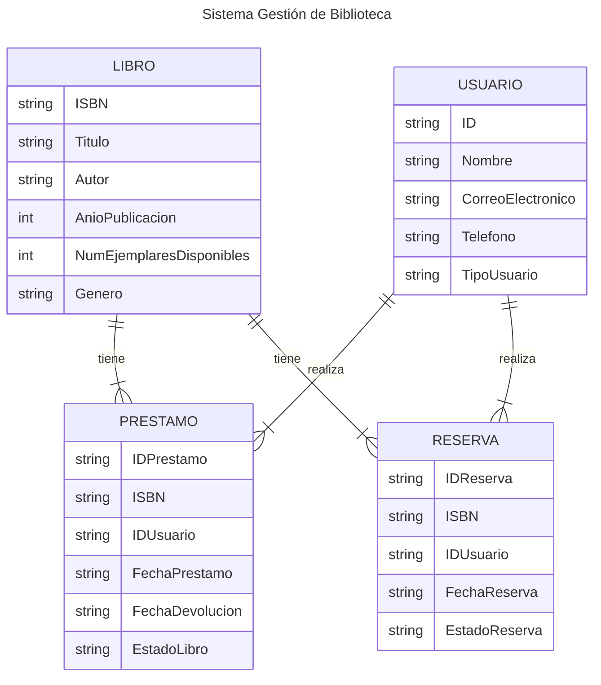

```mermaid
---
title: "Sistema Gestión de Biblioteca"
---
erDiagram

    LIBRO {
        string ISBN
        string Titulo
        string Autor
        int AnioPublicacion
        int NumEjemplaresDisponibles
        string Genero
    }
    USUARIO {
        string ID
        string Nombre
        string CorreoElectronico
        string Telefono
        string TipoUsuario
    }
    PRESTAMO {
        string IDPrestamo
        string ISBN
        string IDUsuario
        string FechaPrestamo
        string FechaDevolucion
        string EstadoLibro
    }
    RESERVA {
        string IDReserva
        string ISBN
        string IDUsuario
        string FechaReserva
        string EstadoReserva
    }
    LIBRO ||--|{ PRESTAMO : "tiene"
    USUARIO ||--|{ PRESTAMO : "realiza"
    USUARIO ||--|{ RESERVA : "realiza"
    LIBRO ||--|{ RESERVA : "tiene"
```